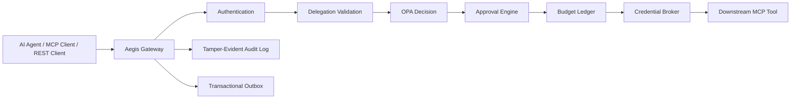

# Aegis - Security Control Plane for AI Agents

Aegis is a multi-tenant gateway that sits between AI agents and external tools. Its job is to make every tool invocation prove its authority instead of trusting a plausible agent request. The Milestone 0 slice in this repository starts the production shape: a Go gateway, PostgreSQL schema, dependency-aware health checks, structured logs, OpenTelemetry wiring, local Docker Compose stack, policy seed, and the first delegated-authorization domain tests.

## Architecture



The data plane is the latency-sensitive path through the gateway. The control plane manages tools, policies, delegations, budgets, approvals, credentials, policy simulation runs, and audit exploration. Background workers drain the transactional outbox to NATS, expire stale approvals, release stale budget reservations, lease unknown-outcome invocations for reconciliation, lease and complete policy simulation summaries, and generate audit roots.

## One-Command Local Startup

```sh
make bootstrap
make up
make migrate
make seed
```

The local stack includes PostgreSQL, Redis, NATS JetStream, OPA, Keycloak, OpenBao, OpenTelemetry Collector, Prometheus, Grafana, and the gateway.

## Demo Credentials

Development-only credentials are kept in `.env.example`:

- PostgreSQL: `aegis` / `aegis_dev_password`
- Keycloak admin: `admin` / `admin`
- OpenBao dev token: `dev-root-token`
- Grafana admin: `admin` / `admin`

Never use these outside local development.

## Curl Examples

```sh
curl -fsS http://localhost:8080/live
curl -fsS http://localhost:8080/ready
curl -fsS http://localhost:8080/metrics
curl -fsS http://localhost:8080/.well-known/oauth-protected-resource
curl -fsS "http://localhost:8080/v1/tools?tenant_id=tenant_acme"
curl -fsS "http://localhost:8080/v1/policy/bundles?tenant_id=tenant_acme"
curl -fsS "http://localhost:8080/v1/policy/simulations?tenant_id=tenant_acme"
```

The gateway includes a deterministic local invocation engine for development and tests. Readiness fails closed if PostgreSQL is unavailable. When `AEGIS_AUTH_ENABLED=true`, protected routes such as `/v1/whoami`, `/v1/invocations`, and `/mcp` require a valid JWT.

Seed data registers `local-policy-v1` as the active Acme bundle, a `candidate-demo` bundle that raises the refund review threshold, and one high-value refund sample for replay. Policy bundle registration, activation, and simulation queueing are exposed through `/v1/policy/bundles` and `/v1/policy/simulations`; each mutation writes a redacted outbox event for asynchronous consumers.

## MCP Client Configuration

The Streamable HTTP MCP endpoint is reserved at:

```json
{
  "mcpServers": {
    "aegis": {
      "url": "http://localhost:8080/mcp",
      "headers": {
        "Authorization": "Bearer <access-token>"
      }
    }
  }
}
```

MCP `tools/list` and `tools/call` route through the same invocation pipeline as REST, including schema validation, delegation checks, policy decisions, approvals, idempotency, budget handling, credential scoping, execution, and audit.

## Approval Walkthrough

Seed data includes an Acme refund delegation with a maximum automatic amount of `1000000` paise. The initial Rego policy allows refunds at or below that threshold and requires two finance approvals above it. The approval API and state machine are implemented in Milestone 5.

Run the local demo script after the gateway is up:

```sh
make demo
```

The script submits a low-risk refund, submits a high-value refund, applies two finance approvals, and verifies the audit chain.

## Audit Verification

The schema includes hash-chained `audit_events` and `audit_roots`. The `cmd/audit-verifier` binary can verify exported audit JSON offline, detect tampering, compare an expected root hash, and emit a root manifest:

```sh
go run ./cmd/audit-verifier -file ./audit-events.json -tenant tenant_acme -root-out ./audit-root.json
```

Without `-file`, the verifier keeps its deployment readiness behavior and checks PostgreSQL connectivity. See `docs/audit-verifier.md` for export formats and incident-response usage.

## Test Commands

```sh
make test
make test-policy
make test-race
make test-integration
```

The integration test expects `AEGIS_TEST_DATABASE_URL` or the `DATABASE_URL` Makefile variable to point at a running PostgreSQL database.

## Current Limitations

This is a deterministic local vertical slice, not yet a complete distributed production deployment. JWT validation, tenant-aware protected route wiring, runtime-selectable OPA policy evaluation, Redis-backed rate-limit checks, OpenBao-backed scoped credentials, local policy decisions, risk scoring, budget reservations, approvals, demo execution, idempotency, audit-chain verification, policy bundle registration, metadata-driven policy replay, PostgreSQL outbox producers for API outcomes, NATS outbox publishing, and an admin UI source tree exist. PostgreSQL-backed persistence for every subsystem, execution of real OPA bundle artifacts during replay, and complete Keycloak claim mapping still need hardening.
