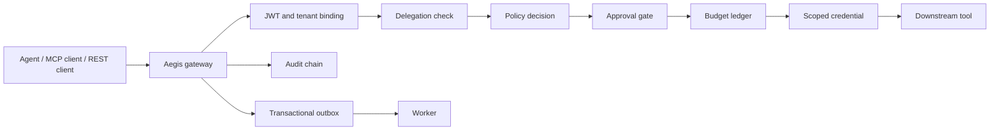

# Aegis

Aegis is a security control plane for AI-agent tool use. It sits between agents and downstream tools, turns each request into a tenant-scoped invocation, checks the caller's delegation, evaluates policy, handles approvals and budgets, issues a short-lived credential, executes the tool, and records what happened.

This repository is a local development build of that path. It includes a Go gateway, a worker, PostgreSQL schema, deterministic demo engine, OPA/Redis/OpenBao/NATS adapters, MCP demo services, audit verification, a small admin UI, and documentation for the security model. It is useful for review, demos, and tests; it is not a hardened production deployment yet.

## How It Fits Together



The gateway is the request path. The worker handles work that should not sit on the request path: outbox delivery, approval expiry, stale budget reservation cleanup, reconciliation leasing, policy replay, and audit-root generation.

The local engine uses fixed Acme demo identities and in-memory stores so the whole flow can run without external accounts. Runtime adapters can switch policy checks to OPA, rate limits to Redis, credentials to OpenBao, and event publication to NATS.

## Local Startup

```sh
make bootstrap
make up
make migrate
make seed
```

The Docker Compose stack includes PostgreSQL, Redis, NATS JetStream, OPA, Keycloak, OpenBao, OpenTelemetry Collector, Prometheus, Grafana, the gateway, and the worker.

Development credentials live in `.env.example`:

- PostgreSQL: `aegis` / `aegis_dev_password`
- Keycloak admin: `admin` / `admin`
- OpenBao dev token: `dev-root-token`
- Grafana admin: `admin` / `admin`

These credentials are only for the local Compose environment. Do not reuse them on a shared or public system.

## Useful Calls

```sh
curl -fsS http://localhost:8080/live
curl -fsS http://localhost:8080/ready
curl -fsS http://localhost:8080/metrics
curl -fsS http://localhost:8080/.well-known/oauth-protected-resource
curl -fsS "http://localhost:8080/v1/tools?tenant_id=tenant_acme"
curl -fsS "http://localhost:8080/v1/policy/bundles?tenant_id=tenant_acme"
curl -fsS "http://localhost:8080/v1/policy/simulations?tenant_id=tenant_acme"
```

Protected routes require a valid JWT when `AEGIS_AUTH_ENABLED=true`. With auth disabled, the local demo uses `tenant_acme` unless a tenant is passed explicitly.

## Demo Flow

Seed data sets up Acme Support:

- Tenant: `tenant_acme`
- Subject: `user_123`
- Agent: `agent_refund_assistant`
- Tool: `payments.refund`
- Auto-refund delegation: `dlg_auto_refund`
- Finance-review delegation: `dlg_789`
- Approval threshold: Rs 10,000 (`1,000,000` paise)
- Approvers: `approver_finance_1` and `approver_finance_2`

Run the PowerShell demo after the stack is up:

```sh
make demo
```

The script submits a small refund, submits a high-value refund that waits for two finance approvals, applies both approvals, and verifies the audit chain.

The seed also registers two policy bundles. `local-policy-v1` is active. `candidate-demo` raises the refund review threshold and is used by policy replay to show an approval-to-allow change against a seeded high-value refund sample.

## MCP

The gateway exposes Streamable HTTP MCP at:

```json
{
  "mcpServers": {
    "aegis": {
      "url": "http://localhost:8080/mcp",
      "headers": {
        "Authorization": "Bearer <access-token>"
      }
    }
  }
}
```

`tools/list` returns tools visible to the caller. `tools/call` re-enters the same invocation pipeline as REST: schema validation, delegation, policy, approvals, idempotency, budget checks, credential scoping, execution, and audit.

## Audit Verification

The schema stores hash-chained `audit_events` and periodic `audit_roots`. The verifier can check exported audit JSON offline:

```sh
go run ./cmd/audit-verifier -file ./audit-events.json -tenant tenant_acme -root-out ./audit-root.json
```

Without `-file`, the verifier checks PostgreSQL connectivity using the same configuration as the gateway. See `docs/audit-verifier.md` for export formats and incident-response usage.

## Checks

```sh
make test
make test-policy
make test-race
make test-integration
make admin-build
```

The integration test expects `AEGIS_TEST_DATABASE_URL` or the `DATABASE_URL` Makefile variable to point at a running PostgreSQL database.

## Current State

Working in this build:

- JWT validation and tenant binding
- Delegation validation
- REST and MCP invocation paths
- Local policy decisions and optional OPA evaluation
- Approval requests and separation-of-duties checks
- Budget reservation and release logic
- Redis-backed strict rate limiting when configured
- Scoped credentials through the local provider or OpenBao
- Deterministic downstream demo execution
- Idempotency conflict detection
- Tamper-evident audit verification
- Transactional outbox producers and NATS worker publishing
- Policy bundle registration, activation, and metadata-driven replay
- Admin UI source for operational inspection

Still not production-hardened:

- PostgreSQL is not yet the backing store for every runtime subsystem.
- Policy replay compares metadata-driven bundle behavior; executing archived OPA bundle artifacts during replay still needs a dedicated adapter.
- Keycloak realm mappers for Aegis-specific claims need a complete deployment profile.
- Development audit-root signatures should move to KMS-backed signing before external publication.
- The Compose stack is for local development, not a secure shared environment.
